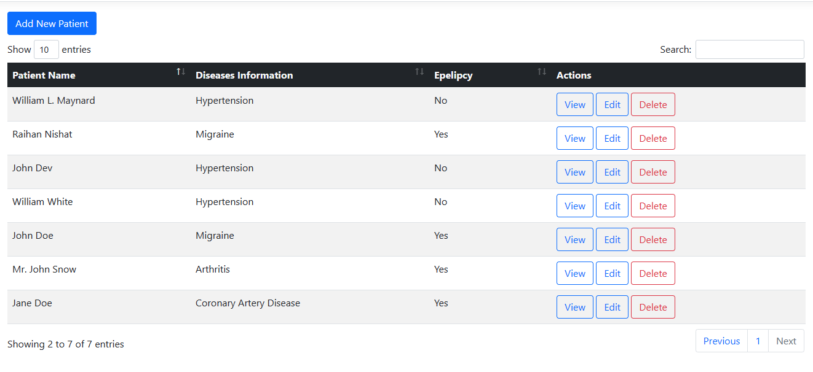
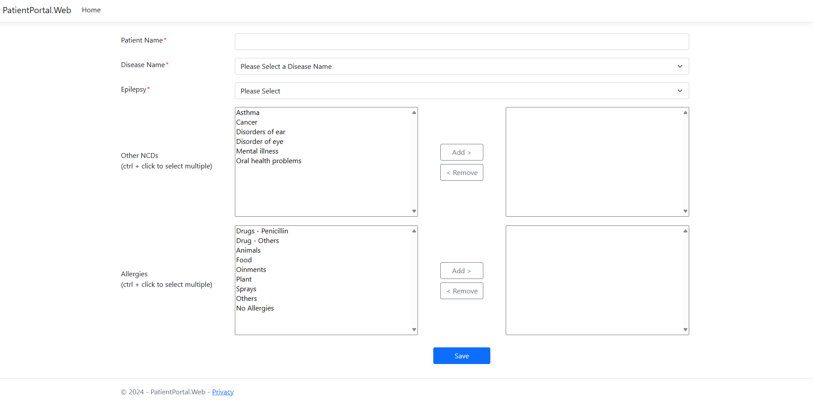
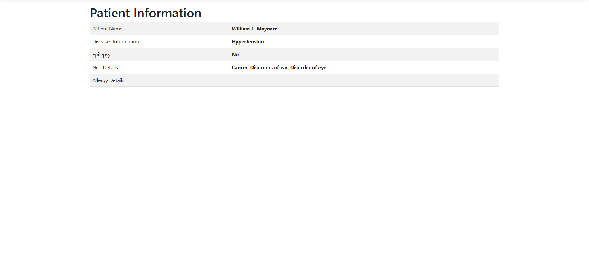
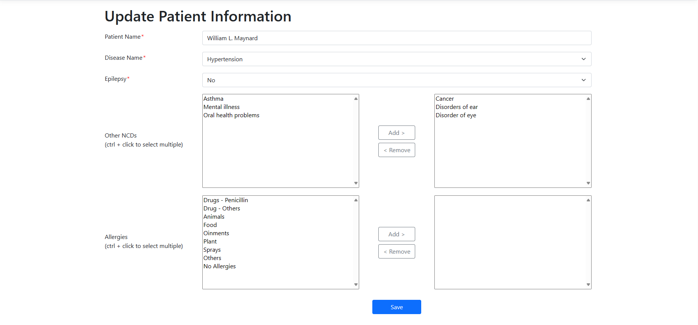

# Patient Portal
This is a small patient information portal that is developed using C# 12, Asp .NET Core MVC, Asp .NET Core Web API, EF Core and MSSQL server.

### Folder Structure
- src
    - PatientPortal.Domain
    - PatientPortal.Api
    - PatientPortal.Web

- tests
    - PatientPortal.Api.Tests

### Migration Commands

```bash
dotnet ef migrations add CreateApplicationsTable -p src/libraries/PatientPortal.Domain -c ApplicationDbContext -s src/PatientPortal.Api
```

```bash
dotnet ef database update -p src/libraries/PatientPortal.Domain -c ApplicationDbContext -s src/PatientPortal.Api
```

### How to run the application
- Clone the repository.

- Setup connection string in both `PatientPortal.Web` and `PatientPortal.Api` project.

- Database backup script has been provided into the `docs` folder. Make sure to create the database and execute the database script.

- Start the application.

- Upon starting the `PatientPortal.Web` and `PatientPortal.Api` application, you will see the home page and patient information table.

<div style="text-align:left;">
    
</div>

- To create new patient information click `Add New Patient` button and you will be navigated to the patient create form.

<div style="text-align:left;">
    
</div>

- View Patient Informations
<div style="text-align:left;">
    
</div>

- Edit Patient Informations
<div style="text-align:left;">
    
</div>
